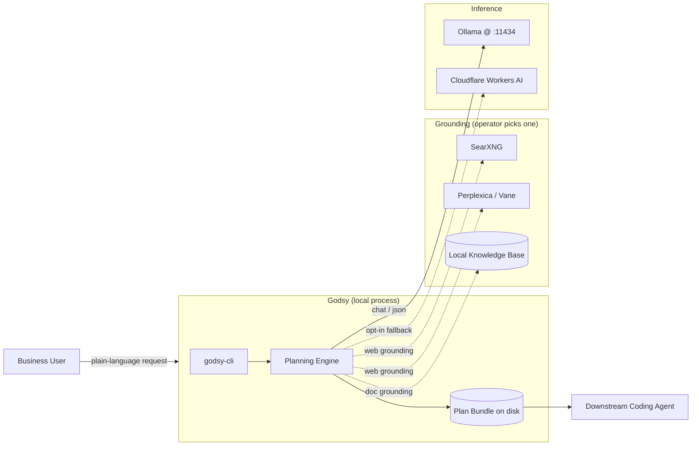
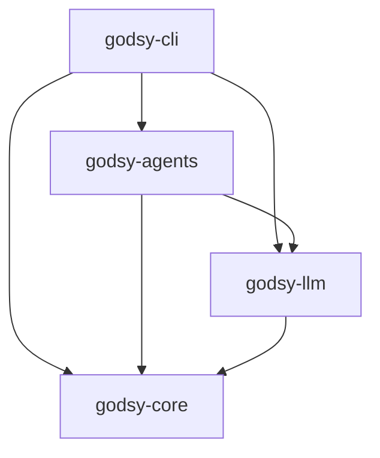
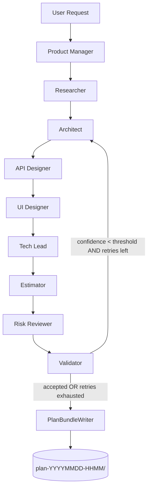
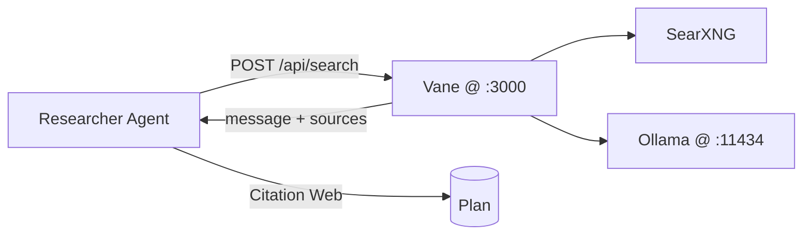

# Godsy — Architecture

> Companion to `.\prd.md`. The PRD says *what* Godsy is and *why*. This document says *how it is built* and *why each boundary exists*. If the two ever disagree, the PRD wins for product intent and this file wins for implementation shape.

---

## 1. One-Line Summary

Godsy is a **local-first, in-process multi-agent planning pipeline** that turns a plain-language business request into a validated, executable **Plan Bundle** (`PRD.md` + `API.md` + `UI.md` + `CODING_AGENT_PROMPT.md`) ready to hand to a single downstream coding agent.

It is **not** a code generator, a runtime, an IDE, or an automation engine. The product surface ends the moment the bundle is on disk.

---

## 2. Architectural Principles

These are the non-negotiable constraints every design decision below is checked against.

1. **Planning, not building.** No agent, no module, no future feature emits compilable user-application code. The single shippable artifact is markdown + JSON.
2. **Local-first.** The release binary defaults to on-device inference (Ollama). The only network egress allowed by default is to `localhost`. Cloud inference is opt-in and gated by config.
3. **Real configs, no mocks in release.** `MockProvider` is behind a `test-support` Cargo feature; the release binary cannot link it. Every config value lives in a typed, range-validated TOML schema (`deny_unknown_fields`).
4. **Warnings are errors.** The workspace denies `unused`, `rust_2018_idioms`, `unreachable_pub`, `missing_debug_implementations`, and clippy `all`/`correctness`/`suspicious`/`perf`. Fixes are real fixes, not `#[allow(...)]`.
5. **Role separation prevents hallucination.** No single agent both proposes and approves. Proposing roles (Architect, API Designer, UI Designer, Tech Lead) and approving roles (Risk Reviewer, Validator) are distinct types.
6. **Mechanical verification beats LLM self-checks.** Structural integrity of the plan (cross-references between tasks, components, entities, endpoints, screens) is enforced by pure Rust code in `godsy-core::verify`, not by asking an LLM "is this consistent?".
7. **Single coding-agent feasibility.** Every task in the plan must be executable in one coding-agent turn. The Estimator enforces this; oversized tasks are routed back to the Tech Lead.

---

## 3. System Context



**Hard boundaries:**

- Godsy never writes outside its configured `output.out_dir`.
- Godsy never talks to the downstream coding agent. The handoff is a markdown file the user pastes manually.
- Perplexica and SearXNG are external processes Godsy *consumes*, never embeds.

---

## 4. Code Topology — Cargo Workspace

The repository is a Cargo workspace with four crates. The split is intentional: each crate has a single reason to change and zero upward dependencies.

```
.\Cargo.toml                    workspace root + lint policy
.\crates\godsy-core\            pure types, serialization, bundle writer, structural verifier, config
.\crates\godsy-llm\             LlmProvider trait + OllamaProvider (release) + MockProvider (test-only)
.\crates\godsy-agents\          9 planning agents + orchestrator + prompts
.\crates\godsy-cli\             clap-based entry point; `init` and `plan` subcommands
```

### 4.1 Dependency direction



- `godsy-core` has **no** workspace dependencies — only external crates (`serde`, `time`, `uuid`, `toml`, `thiserror`).
- `godsy-llm` depends on `godsy-core` only for error types.
- `godsy-agents` depends on both, and is the only crate that knows the prompts.
- `godsy-cli` is the only crate with `main()`.

No cycles. No back-edges. A new orchestrator implementation (`swarms-rs`-backed, Phase 5b) can be added as a sibling to the in-process orchestrator without touching `godsy-core`.

### 4.2 What lives in `godsy-core`

| Module | Purpose |
|---|---|
| `plan.rs` | `Plan`, `ProblemStatement`, `Architecture`, `Component`, `DataModel`, `Entity`, `StackDecision`, `RiskItem` |
| `api_spec.rs` | `ApiSpec`, `ApiEndpoint`, `HttpMethod`, `ApiBody`, `ApiField`, `AuthScheme` — drives `API.md` |
| `ui_spec.rs` | `UiSpec`, `UiScreen`, `UiComponent`, `BusinessLogicAnalysis`, `BusinessRule`, `Workflow` — drives `UI.md` |
| `task.rs` | `Task`, `Complexity` |
| `citation.rs` | `Citation`, `CitationKind` (`File` \| `Web` \| `KnowledgeBase`) |
| `confidence.rs` | per-section scoring + threshold check |
| `verify.rs` | mechanical structural verifier (Layer 3) |
| `bundle.rs` | the `PlanBundleWriter` that emits all 10 bundle files |
| `config.rs` | `GodsyConfig` TOML schema, env overrides, range validation |
| `error.rs` | `CoreError` |

This crate has **no async** and **no I/O beyond the bundle writer and config loader**. It is trivially unit-testable.

### 4.3 What lives in `godsy-llm`

| Module | Purpose |
|---|---|
| `provider.rs` | `LlmProvider` trait, `ChatRequest`, `ChatResponse`, `Role`, `LlmError` |
| `ollama.rs` | `OllamaProvider` — real `POST /api/chat` against an Ollama daemon, `format=json` toggle, configurable timeout |
| `mock.rs` (test-support) | `MockProvider` with `when_contains(substring, response)` rules — only compiled with `--features test-support` |

The release binary cannot construct a `MockProvider`. This is enforced by `#[cfg(any(test, feature = "test-support"))]` on the module.

### 4.4 What lives in `godsy-agents`

```
crates\godsy-agents\src\
  agent.rs          PlanningAgent trait, AgentContext, AgentError
  prompts.rs        all system prompts (one const per agent role)
  orchestrator.rs   in-process sequential orchestrator + validator rejection loop
  agents\
    product_manager.rs   problem statement extraction
    researcher.rs        candidate libs / prior art (citation seed)
    architect.rs         components, data model, mermaid, stack
    api_designer.rs      endpoints + entity_refs + component_refs
    ui_designer.rs       screens + shared components + business-logic analysis
    tech_lead.rs         ordered atomic tasks with dependencies
    estimator.rs         flags oversized tasks
    risk_reviewer.rs     risks + mitigations
    validator.rs         confidence per section + structural Layer-3 check
```

Each agent has its own unit test against `MockProvider` and a hand-crafted JSON response. The end-to-end test in `crates\godsy-agents\tests\end_to_end.rs` exercises all 9 agents in sequence.

### 4.5 What lives in `godsy-cli`

A clap binary with exactly two subcommands today (`init`, `plan`). It loads `godsy.toml`, applies CLI flag and env-var overrides, instantiates the real `OllamaProvider`, runs the orchestrator, and calls the bundle writer. It is intentionally thin — all logic worth testing lives below it.

---

## 5. The 9-Agent Pipeline



### 5.1 Why this order

| Step | Why it sits here |
|---|---|
| PM first | Without a structured problem statement, every downstream agent invents its own. |
| Researcher second | Establishes the *citation pool* before any opinionated decision is made. Architect's stack must reference Researcher's citation IDs. |
| Architect | Owns the components + data model + stack. Everything downstream is a transformation of this. |
| API Designer | Reads architecture components and data-model entities and produces the HTTP contract. Cannot invent components or entities; `entity_refs` / `component_refs` are mechanically verified. |
| UI Designer | Reads API endpoints + entities and produces screens + business-logic analysis. `api_endpoint_refs` / `entity_refs` are mechanically verified. |
| Tech Lead | Only now is enough known to break work into atomic, ordered, single-agent-executable tasks. |
| Estimator | Cheap pass — flags any `complexity = L` task back to the Tech Lead for splitting. |
| Risk Reviewer | Adversarial. Has read everything above and challenges it. |
| Validator | Computes per-section confidence, runs `verify_structure`, accepts or rejects. |

### 5.2 Validator rejection loop

If the Validator's confidence is below `orchestrator.confidence_threshold` (default `0.8`), the orchestrator routes back to the Architect — **not** the Product Manager. The problem statement is treated as immutable across a single session; only the engineering response is allowed to mutate. Loop cap is `orchestrator.max_validator_retries` (default `1`). After the cap, the plan is written anyway with the failing confidence report so the user can decide.

### 5.3 Why no Coder / Tester / Reviewer agent

That work belongs to the downstream coding agent. Adding them here would (a) double the token cost, (b) generate code Godsy is not the right environment to validate, and (c) blur the product boundary the PRD draws at §2. This is enforced socially in `.\AGENTS.md` and structurally by the fact that no agent module accepts a writeable file-system handle.

---

## 6. The Plan Bundle — the Unit of Value

```
plan-YYYYMMDD-HHMM/
  PRD.md                     execution plan, the business user reads this
  API.md                     backend HTTP contract, the coding agent reads this
  UI.md                      UI architecture + business-logic analysis
  CODING_AGENT_PROMPT.md     single paste-into-one-coding-agent prompt
  risks.md                   risks + mitigations
  tasks.json                 ordered atomic tasks, machine-readable
  confidence.json            per-section confidence + citation refs
  plan.json                  full machine-readable plan
  audit.log                  JSONL audit trail (one event = one line)
  sources/<citation_id>.json cached citation payloads
```

### 6.1 Why three primary markdown documents

A single mega-document is unreadable for the business user and brittle for the coding agent. Splitting on natural boundaries lets each consumer ignore what they don't need:

- **`PRD.md`** — written for the business user; renders fine on any markdown reader.
- **`API.md`** — written for the coding agent; the format mirrors what an OpenAPI consumer expects but stays markdown so the coding agent can quote it back.
- **`UI.md`** — written for the coding agent; includes the **business-logic analysis** that production UIs always under-document.

`CODING_AGENT_PROMPT.md` is the single most important file: it is a literal prompt that references the three above as the binding spec.

### 6.2 Machine-readable companions

`plan.json`, `tasks.json`, `confidence.json` are the same data as the markdown documents, but emitted by `serde_json` for any future tool (web dashboard, Tauri Plan Viewer, regression diff) to consume without parsing markdown.

---

## 7. Hallucination Prevention — Four Layers

This is the system-level argument for why Godsy's output is more trustworthy than asking a single LLM "plan my project."

| Layer | Mechanism | Where it lives |
|---|---|---|
| 1 — Source Grounding | Researcher attaches citations (`Citation` with `source_url` + retrieved-at); Architect's `stack.citation_ids` must reference real citations. | `godsy-core::citation`, `godsy-agents::agents::researcher` |
| 2 — Role Separation | Proposing types (`ArchitectAgent`, `TechLeadAgent`) and approving types (`RiskReviewerAgent`, `ValidatorAgent`) are distinct. The orchestrator is the only place they meet. | `godsy-agents::orchestrator` |
| 3 — Structural Verification | Pure-Rust check: every `component_ref`, `entity_ref`, `api_endpoint_ref`, `depends_on` resolves to a real id; tasks have no forward dependencies; no duplicate ids. | `godsy-core::verify::verify_structure` |
| 4 — Confidence Score | Validator scores each section 0..1; sections below `threshold` are surfaced in `confidence.json` and trigger the rejection loop. | `godsy-core::confidence`, `godsy-agents::agents::validator` |

Layer 3 is the cheapest and the most effective. Anything that can be caught by Rust code is caught by Rust code; the LLM is asked only to score what cannot.

---

## 8. Configuration & Operator Control

A single TOML file, `godsy.toml`, drives everything. It is loaded by `GodsyConfig::load`, parsed with `deny_unknown_fields`, and range-validated.

```toml
[model]
provider = "ollama"               # "ollama" | "cloudflare_workers"
base_url = "http://localhost:11434"
model = "qwen2.5"
temperature = 0.2                 # validated to [0, 2]
request_timeout_secs = 180

[orchestrator]
max_validator_retries = 1
confidence_threshold = 0.8        # validated to [0, 1]

[output]
out_dir = "plans-out"
```

Env overrides (applied after parse, before validate): `GODSY_MODEL`, `GODSY_MODEL_BASE_URL`, `GODSY_OUT_DIR`, `GODSY_GROUNDING_URL`, `OLLAMA_API_KEY`, `GODSY_API_KEY`.

CLI overrides on `godsy plan`: `--config`, `--out`, `--model`, `--model-url`/`--ollama-url`, `--provider`, `--api-key`, `--grounding`, `--grounding-url`, `--explain`, `--strict`.

`model.provider` accepts `ollama` (local) or `ollama_cloud` (hosted at `https://ollama.com` or any auth-proxied Ollama). Both routes go through the same `OllamaProvider`; `ollama_cloud` requires `model.api_key` (validated at load time).

The `[grounding]` block selects the web-grounding gateway:

```toml
[grounding]
provider = "vane"                 # "none" | "vane"
base_url = "http://localhost:3000"
max_hits = 6
request_timeout_secs = 60

[grounding.vane]
focus_mode = "webSearch"
optimization_mode = "balanced"
chat_provider = "ollama"
chat_model = "llama3.1"
embedding_provider = "ollama"
embedding_model = "nomic-embed-text"
```

---

## 9. Grounding Gateway — Vane

The Researcher agent calls the configured `GroundingProvider` first, then asks the LLM to extend the seed citations. **Vane** ([ItzCrazyKns/Perplexica](https://github.com/ItzCrazyKns/Perplexica), recently rebranded) is the only first-class gateway: a self-hosted, local-first AI answering engine that wraps SearXNG plus an Ollama-backed (or cloud) model and returns an *answered, source-cited* response.

- Godsy points at `http://localhost:3000` (Docker: `docker run -p 3000:3000 itzcrazykns1337/vane:latest`).
- The Researcher sends `POST /api/search` with `chatModel`, `embeddingModel`, `optimizationMode`, `focusMode`, `query`. It receives `{ message, sources[] }` and turns each entry in `sources[]` into a `Citation { kind: Web, id = "g-{uuid}" }`.
- Vane's internal chat/embedding models are **separate** from Godsy's planning model — operators can run a smaller answering model behind Vane without weakening Godsy's reasoning.
- Pro: pre-synthesised summaries reduce token cost in the Researcher; cited sources are already ranked; one HTTP surface to debug instead of two.
- Direct SearXNG was deliberately dropped: Vane already wraps it, so running both would only duplicate config and test surface for no extra signal.



The `GroundingProvider` trait remains gateway-agnostic, so a future provider (KB, internal docs index) plugs in without touching agents.

---

## 10. Threat & Trust Model

| Asset | Threat | Mitigation |
|---|---|---|
| Business request text | exfiltration via cloud LLM | Default provider is local Ollama; cloud is opt-in and explicit in `godsy.toml`. |
| Cloudflare credentials | leaked logs | OS keychain at-rest (Phase 8); never in tracing spans. |
| Plan bundle | accidental commit of sensitive data | Bundle lives under `output.out_dir`, `.gitignore`d by default scaffolding. |
| Downstream coding-agent prompt | prompt injection from researched pages | Researcher snippets are quoted into prompts inside ` ``` ` fences; structural-verification rejects refs that don't resolve, so an injected "create endpoint X" cannot survive Validator if X is not in the Architect output. |
| LLM hallucination | invented library / API | Layer 1 citation requirement + Layer 3 structural check. A library named in the plan with no matching citation lowers Validator score below threshold. |

Out of scope: protecting the host machine itself, model-weights tampering, supply-chain attacks on Cargo dependencies.

---

## 11. Quality Gates

A change is mergeable only if all of these pass:

```cmd
cargo fmt --check --manifest-path c:\Users\Jay\git\Godsy\Cargo.toml
cargo clippy --manifest-path c:\Users\Jay\git\Godsy\Cargo.toml --workspace --all-targets -- -D warnings
cargo test --manifest-path c:\Users\Jay\git\Godsy\Cargo.toml --workspace
```

Today: 20 tests passing (7 `godsy-core`, 2 `godsy-llm`, 10 `godsy-agents` unit, 1 end-to-end). Clippy clean with the workspace lint policy in `.\Cargo.toml`.

---

## 12. Extension Points

When new work lands, the change should slot into one of these seams. Anything that doesn't fit is a sign the architecture needs a new section, not a workaround.

| Need | Seam |
|---|---|
| New planning role | Add a module under `crates\godsy-agents\src\agents\`, add a const prompt to `prompts.rs`, wire into `orchestrator.rs` at the correct order. Update the `Plan` struct only if the role produces a new top-level field. |
| New LLM provider | Implement `LlmProvider` in a new module under `crates\godsy-llm\src\`. The orchestrator and agents need no change. |
| New grounding gateway | Implement the `Grounder` trait (Phase 6) and consume from `ResearcherAgent`. Citations remain `Citation { kind, source_url, snippet }`. |
| New bundle output file | Add a method to `PlanBundleWriter` and call it from `write_to`. The `Plan` struct grows only if the file needs a new structured field. |
| swarms-rs orchestrator | Add a sibling to `Orchestrator` exposing the same `run(&AgentContext, request) -> OrchestratorOutcome` signature. The CLI selects between them via config. |
| Tauri desktop shell | Wrap `Orchestrator::run` in a Tauri IPC command under `src-tauri\`; the engine crates do not change. |

---

## 13. What This Architecture Deliberately Refuses

- **No code-emitting agent.** A "Coder" agent has been proposed and rejected; its responsibility belongs to the downstream coding agent. See `.\AGENTS.md` §"Product Intent".
- **No long-running daemon.** Godsy is invoked, writes a bundle, exits. There is no server, no scheduler, no background re-planning.
- **No multi-tenant mode.** Single user, single machine, single in-flight plan. Multi-user is a different product.
- **No retry on transport errors deeper than `LlmError::Transport`.** A network failure surfaces to the user; Godsy does not silently degrade to a weaker provider. Failing loudly is part of the trust story.
- **No `#[allow(warnings)]` shortcuts.** Lint policy in `.\Cargo.toml` is intentionally strict; fixes must be real fixes.
