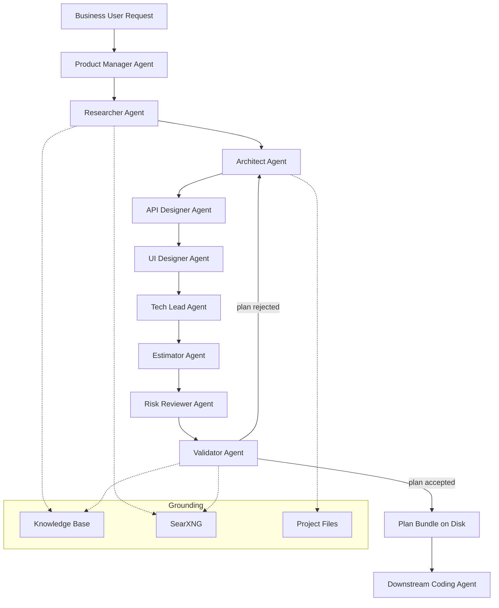

# Godsy
## The Local Agentic Architecture Team for Non-IT Businesses

**Tagline:**
Godsy plans it. One coding agent ships it.

---

# 1. Product Overview

Godsy is a **local-first, multi-agent architecture studio**. It does **not** write production code, build apps, or run automations. Instead, it operates a **virtual engineering team** that takes a plain-language request from a non-technical user and produces a **realistic, feasible, ready-to-execute implementation plan**.

That plan is shaped specifically to be **handed off to a single downstream coding agent** (Claude Code, Cursor, Zencoder, Aider, etc.) which will then build the actual software in one pass — without re-planning, re-scoping, or guessing.

Godsy runs as a desktop application using **Tauri** with a **Rust backend powered by swarms-rs** for multi-agent orchestration. Inference can be:

- Local via **Ollama** (default — keeps business data on-device).
- Cloud via **Cloudflare Workers AI** (opt-in fallback for longer reasoning).
- Web-grounded via **SearXNG** (verify libraries, APIs, pricing, constraints).
- Knowledge-base grounded (uploaded company docs, SOPs, Excel sheets).

The agent team is composed of planning roles only:

- Product Manager
- Researcher
- Architect
- API Designer
- UI Designer
- Tech Lead
- Estimator
- Risk Reviewer
- Validator

---

# 2. What Godsy Is — and Is Not

| Godsy IS | Godsy is NOT |
|----------|--------------|
| A planning and architecture team | A code generator |
| An output that a coding agent can execute | A runtime / automation engine |
| A feasibility and scoping tool | An IDE or build system |
| A bridge between business request and engineering plan | A replacement for the coding agent |

A Godsy session ends the moment a **complete, validated, executable plan** exists on disk. Implementation is somebody else's job — by design.

---

# 3. Target Market

## Primary Market

Non-IT companies in India:

- Manufacturing
- Logistics
- Construction
- Healthcare clinics
- Educational institutions
- Retail
- Small service businesses

These organizations:

- Lack internal software teams.
- Rely heavily on Excel and manual processes.
- Cannot translate "we need a tool for X" into an engineering brief.
- Often pay consultants 5–10× the actual build cost just to get a scoping document.

Godsy collapses that scoping cost to near zero and produces a brief good enough to ship.

---

# 4. Problem Statement

When a non-technical business owner asks an AI coding agent to "build an inventory system," the agent:

1. Makes architecture decisions without understanding the business.
2. Picks frameworks the team cannot maintain.
3. Skips integrations the business actually needs.
4. Produces code that compiles but doesn't fit operations.
5. Wastes tokens, time, and trust on rework.

The missing step is **engineering judgement before code**: scoping, sequencing, risk assessment, integration mapping, and choosing a stack the user can actually run.

Godsy is that missing step.

---

# 5. Product Goals

Godsy must, for any business request:

- Clarify the real operational problem (not the stated one).
- Produce a layered architecture appropriate to the user's scale.
- Choose a stack that is feasible **for a single coding agent** to implement in one session.
- Decompose the build into ordered, atomic, agent-executable tasks.
- Flag risks, unknowns, and integration gaps **before** code is written.
- Attach source grounding, confidence scores, and audit logs to every recommendation.

Every plan ships with:

- a problem statement
- a system architecture diagram
- a data model
- an ordered task list with acceptance criteria
- a feasibility & risk report
- a single-agent execution prompt

---

# 6. Key Value Proposition

## Plans That Survive Contact With a Coding Agent

The output is structured, atomic, and unambiguous — designed for one coding agent to execute end-to-end without further clarification rounds.

## Engineering Judgement, Local

All scoping, architecture, and risk analysis happens on-device. Business data never leaves the machine unless cloud inference is explicitly enabled.

## Reduced Hallucination Through Role Separation

No single agent both proposes and approves. Architect proposes, Reviewer challenges, Validator verifies against grounded sources.

## Cost Efficiency

One Godsy plan replaces a multi-week consultant scoping engagement. The downstream coding agent runs once, not five times.

---

# 7. System Architecture



Orchestration runs in-process inside the Tauri Rust backend via `swarms-rs`. The frontend is a thin chat + plan-viewer UI.

---

# 8. Technology Stack

## Desktop Shell

- **Framework**: Tauri
- **Language**: Rust (backend), TypeScript + a lightweight web framework (frontend)
- **Benefits**: small binaries, sandboxed FS access, low memory footprint suitable for office laptops.

## Agent Orchestration

- **Framework**: `swarms-rs`
- **Responsibilities**: agent lifecycle, role-based message routing, deterministic workflow execution, retry/rejection loops between Validator and Architect.

## Model Providers

### Local Inference (default)

**Ollama** with reasoning-capable models:

- `qwen2.5` / `qwen2.5-coder` — primary planning model
- `deepseek-r1` — long reasoning passes
- `llama3.1` — fallback general reasoning

Note: Godsy uses these for **planning text and structured JSON**, not code generation.

### Cloud Inference (opt-in)

**Cloudflare Workers AI** for:

- long-context plan validation
- web-grounded fact checks
- fallback when local hardware is insufficient

Credentials are encrypted at rest and never logged.

## Grounding

Godsy supports two grounding gateways. Operators pick one at install time; the Researcher and Validator agents are gateway-agnostic.

- **SearXNG (direct)** — meta-search aggregator; Godsy issues a JSON query and consumes raw result links. Lowest dependency, fastest, no LLM in the search loop. Use this when the operator wants every citation to be a raw URL surface.
- **Perplexica / Vane** ([ItzCrazyKns/Perplexica](https://github.com/ItzCrazyKns/Perplexica)) — local-first, self-hosted AI answering engine that wraps SearXNG plus a local Ollama model and returns an answered, source-cited response over HTTP at `http://localhost:3000`. Use this when the operator wants the Researcher agent to receive *pre-synthesised, cited summaries* instead of raw search hits. Godsy treats Perplexica as a remote tool: it sends the Researcher's query, parses the answer + sources, and stores each source as a `Citation` of kind `Web`. The Perplexica model can be different from the model Godsy itself uses for planning.
- **Local Knowledge Base** — uploaded PDFs, SOPs, Excel sheets, prior plans; embedded into a local vector store. Independent of which web gateway is selected.
- **Project Files** — any existing repo the user points Godsy at, for brown-field plans.

Citations from either gateway flow into the same `sources/` directory of the Plan Bundle so the downstream coding agent cannot tell which gateway was used.

---

# 9. Multi-Agent Team Structure

All agents are **planning agents**. None of them produce shippable code.

## Product Manager Agent

- Parses the business request.
- Asks clarifying questions (back to the user, via chat).
- Produces a structured Problem Statement and Success Criteria.

## Researcher Agent

- Searches SearXNG, knowledge base, and provided files.
- Surfaces candidate libraries, frameworks, APIs, and prior art.
- Attaches citations to every claim.

## Architect Agent

- Designs system architecture (components, data flow, storage, deployment).
- Produces Mermaid diagrams and a data model.
- Selects a stack constrained by: user's OS, hardware, hosting capability, and what a single coding agent can implement reliably.

## API Designer Agent

- Given the architecture, data model, and stack, designs the backend HTTP API the coding agent must implement exactly.
- Defines endpoints, methods, paths, auth, request/response bodies, and status codes.
- Cross-references entities (data model) and owning components (architecture).
- Output drives the generated `API.md` document in the Plan Bundle.

## UI Designer Agent

- Given the architecture, data model, and API spec, designs the screens, shared components, and the **business-logic analysis** (rules and workflows).
- Cross-references API endpoints and entities — no invented references.
- Output drives the generated `UI.md` document in the Plan Bundle.

## Tech Lead Agent

- Decomposes the architecture into an ordered list of atomic tasks.
- Each task has: goal, inputs, outputs, files touched, acceptance criteria.
- Guarantees the task graph is executable top-to-bottom by one coding agent.

## Estimator Agent

- Assigns complexity (S/M/L) and token-budget estimates per task.
- Flags tasks too large for a single coding-agent turn and asks the Tech Lead to split them.

## Risk Reviewer Agent

- Challenges every architectural and stack choice.
- Lists integration risks, scaling risks, vendor lock-in, regulatory risks.
- Proposes mitigations or alternates.

## Validator Agent

- Cross-checks claims against sources (Layer 1).
- Verifies internal consistency: data model ↔ tasks ↔ acceptance criteria.
- Computes confidence scores per section.
- Rejects the plan and routes back to Architect if confidence is below threshold.

---

# 10. Hallucination Prevention Strategy

## Layer 1 — Source Grounding

Every non-trivial claim (library exists, API behaves a certain way, regulation applies) must carry a citation: file path, URL, or knowledge-base chunk ID.

## Layer 2 — Role Separation

Proposing agents (Architect, Tech Lead) and approving agents (Risk Reviewer, Validator) are distinct and cannot overwrite each other's outputs. Disagreements force a documented revision.

## Layer 3 — Structural Verification

The plan is parsed as structured JSON. Cross-references (task → component → data model entity) are validated mechanically, not by an LLM.

## Layer 4 — Confidence Score

Each section carries a 0–1 confidence value plus the sources it depends on. Sections below threshold are surfaced to the user before handoff.

---

# 11. Task Execution Workflow

Example user request: *"I want a system to track which trucks delivered which orders today."*

1. **PM**: clarifies — how many trucks, who enters data, mobile or desktop, do drivers have phones, what reports are needed.
2. **Researcher**: confirms feasible stacks (e.g., SQLite + a small web app), checks if user mentioned existing tools (Tally, Excel).
3. **Architect**: proposes a minimal architecture — single binary, local DB, simple web UI, optional CSV export.
4. **Tech Lead**: breaks build into ~12 atomic tasks: scaffold project, create schema, seed data, build entry form, build report view, etc.
5. **Estimator**: confirms each task fits one coding-agent turn.
6. **Risk Reviewer**: flags backup strategy, multi-user concurrency, power-loss handling.
7. **Validator**: verifies all citations resolve, all tasks reference real components, confidence ≥ 0.8.
8. Plan bundle written to disk.

---

# 12. Plan Bundle (the Deliverable)

A directory written to the user's chosen location:

```
plan-YYYYMMDD-HHMM/
  PRD.md                       primary execution plan (markdown)
  API.md                       backend API documentation (markdown)
  UI.md                        UI architecture + business-logic analysis (markdown)
  CODING_AGENT_PROMPT.md       single-prompt handoff for one coding agent
  risks.md                     risks and mitigations
  tasks.json                   ordered, atomic, agent-executable tasks
  confidence.json              per-section confidence and citations
  plan.json                    full machine-readable view of the plan
  audit.log                    JSONL audit trail
  sources/                     cached citation payloads (one JSON per citation id)
```

The three markdown documents are the unit of value:

- **`PRD.md`** captures problem statement, architecture, stack, data model, ordered tasks, acceptance criteria, and confidence — the document the business user reads.
- **`API.md`** captures the exact backend HTTP contract the coding agent must implement, produced by the API Designer Agent.
- **`UI.md`** captures the UI architecture decisions and the business-logic analysis (rules, workflows), produced by the UI Designer Agent.

`CODING_AGENT_PROMPT.md` is the single most important file: it is the literal prompt a user pastes into a coding agent to start the build, and it references the three markdown documents as the binding spec.

---

# 13. User Interface Modules

## Chat Interface

Conversational intake with the Product Manager Agent.

## Plan Viewer

Renders the current draft plan with diff highlights when agents revise it.

## Agent Monitor

Live view of which agent is active, what it is reading, and which sources it is grounding against.

## Knowledge Base

Drag-and-drop ingestion of PDFs, DOCX, XLSX, and existing codebases.

## Model Configuration

Local model selection, optional cloud credentials, SearXNG endpoint.

## Plan History

All past plan bundles with re-open / re-run / export options.

---

# 14. Data Storage

| Data Type | Storage |
|-----------|---------|
| Sessions and conversations | SQLite |
| Plan bundles | Filesystem (user-chosen folder) |
| Embeddings (knowledge base) | Local vector DB (e.g., `sqlite-vec` or `qdrant` embedded) |
| Audit logs | JSON Lines |
| Credentials | OS keychain (encrypted) |

---

# 15. Security

- Local-first by default; no network calls without explicit opt-in.
- API keys stored in OS keychain.
- Agent tools sandboxed; filesystem access scoped to the active workspace.
- No telemetry.

---

# 16. Performance Requirements

| Metric | Target |
|--------|--------|
| Time to first clarifying question | < 5 s |
| Time to complete plan (local models) | < 5 min |
| Time to complete plan (cloud fallback) | < 90 s |
| Concurrent agents | up to 8 |
| Peak memory usage | < 6 GB |

---

# 17. MVP Scope

## Included

- 9-agent planning team (PM, Researcher, Architect, API Designer, UI Designer, Tech Lead, Estimator, Risk Reviewer, Validator).
- Local inference via Ollama.
- SearXNG grounding.
- Knowledge base ingestion (PDF, DOCX, XLSX, MD).
- Plan bundle export.
- Single-agent handoff prompt generation.

## Excluded (MVP)

- Code generation of any kind.
- Multi-user collaboration.
- Cloud sync.
- Distributed agent execution.
- Enterprise SSO.

---

# 18. Success Metrics

| Metric | Target |
|--------|--------|
| Plans accepted unchanged by user | > 70% |
| Hallucinated citation rate | < 3% |
| Plans that compile end-to-end via single coding agent | > 80% |
| Median planning time, local models | < 5 min |

---

# 19. Monetization (India Market)

## Revenue Stream 1 — Desktop License

Per-seat license for the Godsy desktop app.
**₹15,000 – ₹40,000** per license.

## Revenue Stream 2 — Plan-to-Build Services

Customer pays for the plan; partner network executes the build using the generated prompt.
**₹50,000 – ₹3,00,000** per project.

## Revenue Stream 3 — Industry Plan Templates

Pre-grounded knowledge packs for manufacturing, logistics, retail, healthcare.
**₹1,00,000 – ₹5,00,000** per industry pack.

## Revenue Stream 4 — Consulting

Onsite scoping with Godsy.
**₹10,000 – ₹25,000** per day.

## Revenue Stream 5 — Maintenance Subscription

Updates, model refreshes, knowledge-base updates.
**₹5,000 – ₹20,000** per month.

---

# 20. Business Use Cases

| Industry | Example Plan Godsy Produces |
|----------|------------------------------|
| Manufacturing | Production-line shift report tool |
| Logistics | Delivery-truck assignment tracker |
| Retail | Daily inventory reconciliation app |
| Healthcare | Clinic appointment + billing dashboard |
| Education | Attendance and fee-reminder tool |

In every case Godsy produces the **plan**; the user (or a coding agent) builds the tool.

---

# 21. Development Roadmap

## Phase 1 — Planning Core (MVP)

- swarms-rs orchestration with the 7 planning agents.
- Ollama integration.
- Plan bundle export.
- Single-agent handoff prompt.

## Phase 2 — Grounding & Knowledge

- SearXNG integration.
- Knowledge-base ingestion and vector search.
- Citation enforcement.

## Phase 3 — Industry Packs & UX

- Pre-built industry knowledge packs.
- Brown-field mode (point at an existing repo).
- Plan re-run and diffing.

---

# 22. Competitive Advantage

| Feature | Godsy |
|---------|-------|
| Local-only planning | Yes |
| Multi-agent role separation | Yes |
| Output designed for single-agent execution | Yes |
| Grounded citations on every claim | Yes |
| Non-IT-friendly chat intake | Yes |
| No code generation (intentional) | Yes |

---

# 23. Risks

| Risk | Mitigation |
|------|------------|
| User expects code, not a plan | Onboarding clearly frames Godsy as a planning tool. |
| Local models too weak for planning | Cloud fallback; smaller, focused prompts per agent. |
| Hallucinated citations | Validator agent + mechanical citation resolution. |
| Tasks too coarse for coding agent | Estimator splits oversized tasks before handoff. |

---

# 24. Future Expansion

- DevOps plan agents (infra, CI, deployment plans).
- Marketing campaign plan agents.
- Legal-compliance plan agents for regulated industries.
- Direct integrations with downstream coding agents (one-click handoff).

---

# 25. Development Timeline

| Week | Deliverable |
|------|-------------|
| Week 1 | Tauri + swarms-rs scaffold, Ollama wiring |
| Week 2 | PM + Architect + Tech Lead agents end-to-end |
| Week 3 | Estimator, Risk Reviewer, Validator agents |
| Week 4 | Plan bundle writer + single-agent prompt generator |
| Week 5 | SearXNG + knowledge-base grounding |
| Week 6 | Plan Viewer UI + Agent Monitor |

---

# Conclusion

Godsy is **not** another AI tool that writes code. It is the **engineering team that should have existed before the code was written.**

By focusing exclusively on planning, architecture, decomposition, and validation — and by shaping its output for a single downstream coding agent — Godsy turns a non-technical business request into a buildable, trustworthy plan that ships on the first try.
